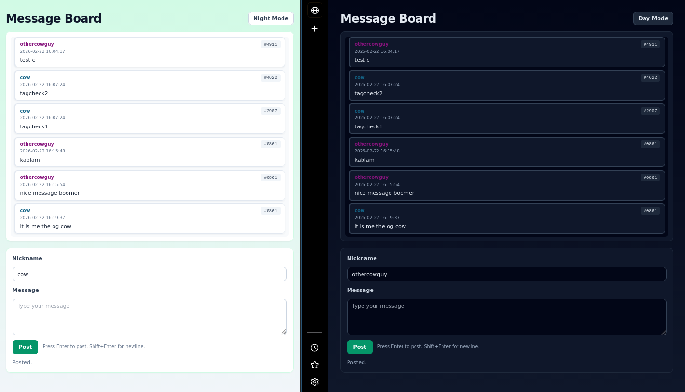

# message-board-c

Tiny message board server in C using `libmicrohttpd` + SQLite.



## archive metadata

- First worked on: `2024-09-05` (initial commit)
- Cleanup/archive pass: `2026-02-22`

## deps

```bash
sudo apt-get install libmicrohttpd-dev libsqlite3-dev cmake build-essential curl
```

## layout

- `src/main.c`: startup/shutdown
- `src/http.c`: route handling and request lifecycle
- `src/db.c`: SQLite schema, migrations, reads/writes
- `src/db_tags.c`: tag assignment + legacy message backfill
- `src/render.c`: template loading and server-side injection
- `src/util.c`: shared helpers (buffers, decoding, responses)
- `src/logging.c`: structured log helpers
- `assets/index.html`: page HTML template
- `assets/app.js`: browser behavior (post, SSE refresh, theme toggle)
- `scripts/build.sh`: configure and build with CMake
- `scripts/run.sh`: build then run the server
- `scripts/dev.sh`: auto-rebuild + restart on source/template changes
- `scripts/clean.sh`: remove `build/`
- `scripts/seed_posts.sh`: generate random test posts

## usage

```bash
./scripts/build.sh
./scripts/run.sh
./scripts/dev.sh
# or legacy wrapper:
./compile_and_run.sh
```

Open `http://127.0.0.1:8888/`.

## features

- SSE live updates (`/events`) so new posts refresh for connected clients
- light/night theme toggle saved in `localStorage`
- per-name color accents in the message list
- persistent 4-digit tags per `(nickname, client_id)` pair
- `messages.json` endpoint for structured message fetches

## live updates

- `GET /events`: Server-Sent Events stream for message broadcasts
- `GET /messages`: HTML fragment for message list
- `GET /messages.json`: structured message data

## nickname tags

- Each `(nickname, client_id)` pair gets a persistent 4-digit tag.
- Display format is `nickname` plus a separate `#tag` chip (example tag: `#0042`).

## seed test data

Run with server already started:

```bash
./scripts/seed_posts.sh                  # default 128 posts
./scripts/seed_posts.sh http://127.0.0.1:8888 256
```
